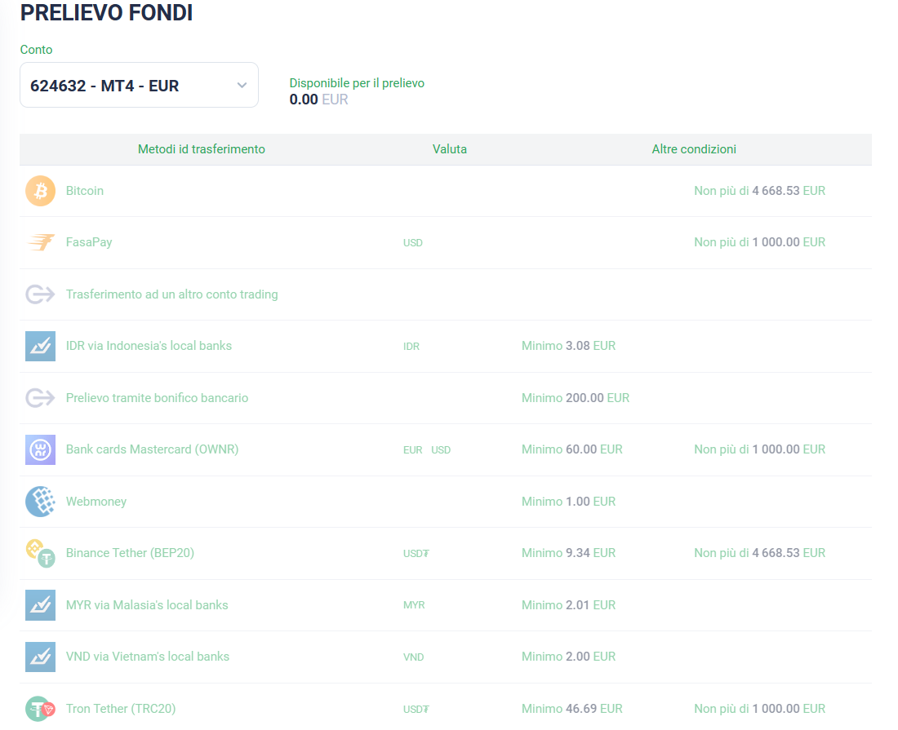

# ➖ Come prelevare

***

Effettuare un prelievo su Esperio è un processo essenziale per gestire i fondi del tuo conto di trading. Segui attentamente i passaggi di questo tutorial per prelevare fondi in modo semplice e sicuro.

<figure><figcaption></figcaption></figure>

### **Passo 1: Accedi al Tuo Account**

1. Accedi al sito ufficiale di **Esperio** utilizzando il tuo browser preferito.
2. Inserisci le tue credenziali di accesso (nome utente e password) nei campi appropriati.
3. Clicca sul pulsante "Accedi" per accedere al tuo account.

### **Passo 2: Navigazione alla Sezione di Prelievo**

1. Una volta effettuato l'accesso, individua il menu di navigazione.
2. Cerca e seleziona l'opzione "Prelievo" o "Ritiro" o un termine simile, solitamente situato nell'angolo superiore destro della pagina.

### **Passo 3: Scelta della Modalità di Prelievo**

1. All'interno della sezione di prelievo, troverai un elenco delle diverse modalità di prelievo disponibili.
2. Scegli la modalità di prelievo che preferisci utilizzare. Le opzioni comuni includono bonifico bancario, carte di credito/debito e portafogli elettronici.

### **Passo 4: Inserimento dell'Importo del Prelievo**

1. Dopo aver selezionato la modalità di prelievo, dovrai inserire l'importo che desideri prelevare dal tuo conto di trading.
2. Assicurati di inserire l'importo in modo accurato e che sia all'interno dei limiti di prelievo consentiti.

### **Passo 5: Verifica e Conferma l'Operazione**

1. Verifica attentamente i dettagli dell'operazione, inclusi l'importo del prelievo e la modalità di pagamento selezionata.
2. Se tutto è corretto, clicca sul pulsante "Conferma" o "Prelievo" per procedere.

### **Passo 6: Completamento della Transazione**

1. A seconda della modalità di pagamento scelta, potresti essere reindirizzato a una pagina esterna o a un modulo di conferma interno.
2. Segui le istruzioni fornite per completare la transazione. Questo potrebbe richiedere ulteriori dettagli, come i dati bancari o i dettagli della carta.

### **Passo 7: Conferma del Prelievo**

1. Dopo aver completato la transazione, riceverai una conferma dell'avvenuto prelievo.
2. Controlla il tuo conto bancario o la tua carta per verificare che i fondi siano stati trasferiti correttamente.

### **Conclusioni**

Effettuare un prelievo su Esperio è un processo semplice e ben guidato. Le diverse modalità di pagamento offrono opzioni flessibili per soddisfare le tue preferenze. Assicurati sempre di verificare attentamente i dettagli prima di confermare l'operazione. Una volta completato il prelievo, sarai in grado di gestire i tuoi fondi in modo efficace e continuare le tue attività di trading con Esperio.
