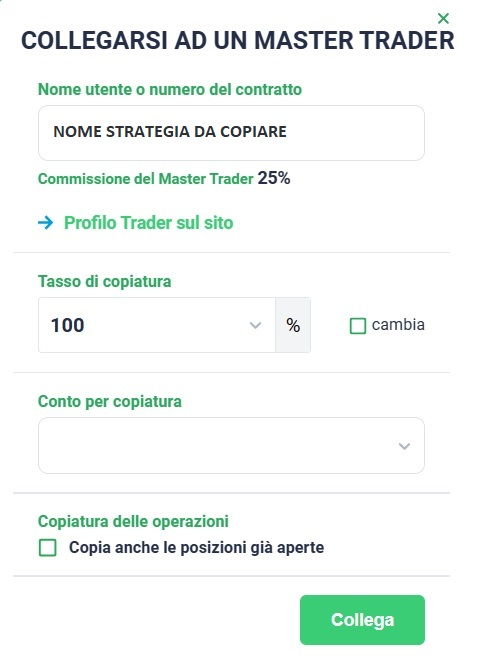

# 🛠 Come Collegare la Strategia

***

Segui questi passaggi dettagliati per collegare una strategia di copytrading sul portale di Esperio:

## Step 1️⃣

### **Accesso all'Account**

**Per avviare la procedura**, effettua l'accesso al tuo account su Esperio utilizzando le **credenziali personali** fornite in fase di registrazione.

Successivamente, per **collegare le strategie di copytrading**, procedi come segue:

1. Riceverai un **link strategia** dal tuo referente designato.
2. **Clicca sul link strategia** ricevuto.

**Nota importante**: Assicurati di seguire attentamente le istruzioni fornite dal tuo referente e di comprendere appieno la strategia di copytrading che stai per collegare al tuo account.&#x20;


**Per garantire la precisione nella connessione alla strategia**, si consiglia vivamente di utilizzare la **navigazione in incognito** del browser. Questa modalità offre la certezza di **collegarsi al link corretto** senza alcuna interferenza. Grazie alla navigazione in incognito, **non vengono memorizzati dati sensibili come la cronologia di navigazione, i cookie, i dati dei form e le password**. Ciò assicura un collegamento sicuro e diretto alla strategia desiderata, riducendo al minimo le possibilità di errori o interruzioni indesiderate.


***

## **Step 2️⃣**

### **Collegamento ad un Master Trader**

**Dopo aver cliccato sul link strategia**, verrà visualizzato un **POP-UP** con il seguente contenuto:

<figure><figcaption></figcaption></figure>

Per collegare la strategia al master trader, è necessario compilare attentamente la schermata "COLLEGARSI AD UN MASTER TRADER" seguendo i seguenti passaggi:

1. **Verifica la correttezza del NOME STRATEGIA**: Assicurati che il nome della strategia visualizzato sia quello corretto e corrispondente a quello che desideri collegare.
2. **Imposta il Tasso di Copiatura al 100%**: Lascia il tasso di copiatura al 100% per garantire la completa replicazione delle operazioni del master trader.
3. **Seleziona il Conto CENT dal Menu a Tendina**: Dall'elenco a discesa, seleziona il **conto CENT** che intendi associare a questa strategia di copytrading.
4. **Disattiva l'Opzione "Copia Anche le Posizioni Già Aperte"**: Assicurati che l'opzione di copia delle posizioni già aperte non sia selezionata, a meno che tu non intenda replicare anche le posizioni in corso.
5. **Cliccare su "Collega"** e inizierete a copiare la strategia.


**Nota Importante:**

* **Verifica attentamente i dettagli**: Prima di confermare, verifica con attenzione tutti i dettagli inseriti nella schermata.
* **Comprendi le Implicazioni**: Assicurati di comprendere appieno le implicazioni di collegare la strategia di copytrading e il relativo conto al master trader.
* **Conferma con Cautela**: Una volta confermato il collegamento, le operazioni del master trader verranno replicate sul tuo conto.
* **Modifiche Future**: Ricorda che potrai sempre modificare o interrompere il collegamento in futuro seguendo le istruzioni fornite dalla piattaforma Esperio.


Dopo aver cliccato su **COLLEGA**, si aprirà un **altro POP-UP**. In questa fase, è sufficiente **fare clic su "Chiudi"** per completare il processo.

<figure><figcaption></figcaption></figure>


Poiché hai già effettuato un **deposito sul tuo conto**, non sarà necessario **fare clic su "Deposita"** in questa fase.


***

## **Step 3️⃣**

### V**erificare** se la procedura è stata completata correttamente.

**Dopo aver completato questi passaggi**, al fine di verificare la corretta connessione del mio conto alla strategia, è necessario **tornare alla home page del broker**. All'interno dell'elenco dei conti, **verrete a visualizzare la dicitura "INVESTITORE COLLEGATO KI-......."** accanto al conto selezionato per la copia della strategia. Tale indicazione confermerà il collegamento stabilito e la corretta configurazione della strategia di copytrading.


**Ciascuna strategia** sarà identificata da un **codice KI univoco**.


<figure><figcaption>
Esempio conto correttamente collegato alla strategia
</figcaption></figure>

***


**Nota Importante:** Prima di avviare il copytrading, è fondamentale **comprendere a fondo il funzionamento, i rischi e le potenziali ricompense** associati a questa pratica.

Ecco alcuni suggerimenti chiave da tenere presente:

* **Diversificazione delle Strategie**: Si consiglia di **diversificare il proprio portafoglio di copytrading** attraverso la copia di più strategie. Questo può contribuire a mitigare i rischi legati a una singola strategia.
* **Monitoraggio e Aggiornamenti Regolari**: **Rimani costantemente aggiornato** riguardo agli sviluppi e agli aggiornamenti relativi alle strategie di copytrading. Adatta le tue scelte in base alle informazioni più recenti.
* **Consapevolezza dei Rischi**: È importante comprendere che il **copytrading comporta rischi finanziari**. Pertanto, prendi decisioni consapevoli e seleziona le strategie che meglio si adattano al tuo **profilo di rischio e obiettivi di investimento**.

Ricorda che la pratica del copytrading richiede una valutazione accurata e una gestione attenta delle tue scelte finanziarie.

