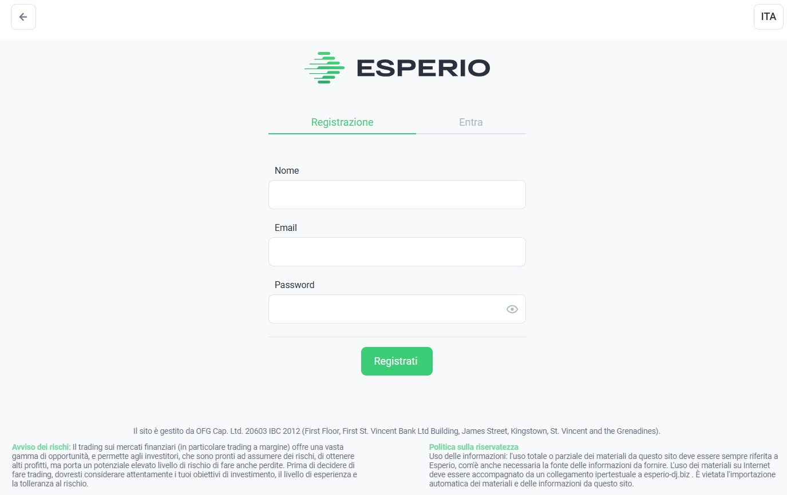
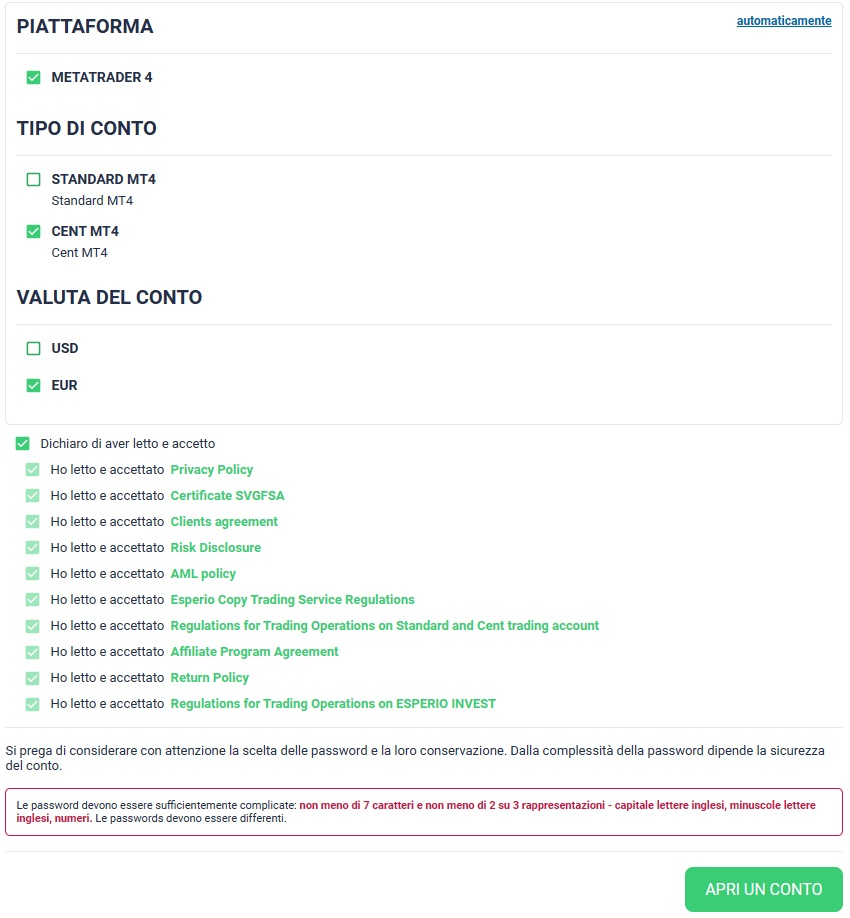
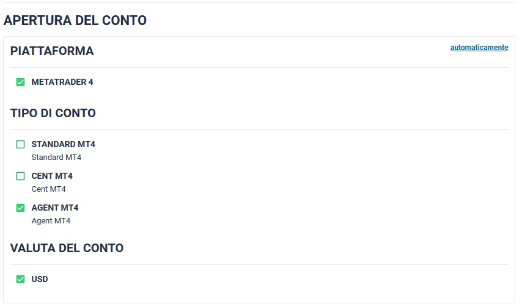
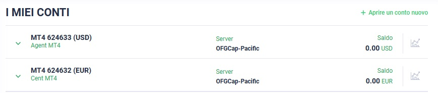
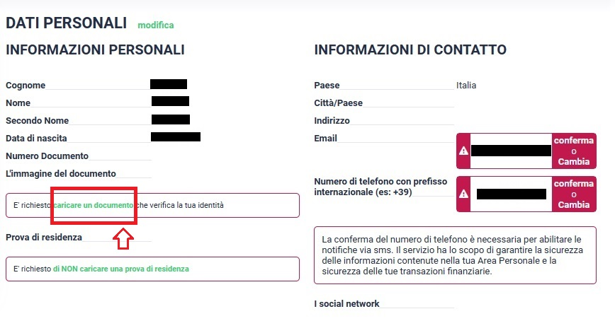

# ⚙ Come Iscriversi

## Step 1️⃣

## **Accesso al Sito Web di Esperio**

Per iniziare il tuo viaggio, inizia registrandoti al broker **utilizzando il link che il tuo referente ti ha fornito**, accedendo al sito ufficiale di Esperio utilizzando il tuo browser preferito.&#x20;


**Naviga in Incognito per la Registrazione**

**Consigliamo** per qualsiasi registrazione di **usare sempre la navigazione in incognito**. Questa è una **funzione offerta dai browser web** che ti consente di **navigare su Internet senza che vengano memorizzati dati come la cronologia di navigazione, i cookie, i dati di form e le password**. In pratica, quando utilizzi la navigazione in incognito, il **browser non salverà le informazioni tipiche della tua attività di navigazione**.

**Come Attivare la Navigazione in Incognito:**

**Su PC Windows:**

1. **Google Chrome:** Apri il browser e clicca sull'icona dei tre punti verticali nell'angolo in alto a destra. Seleziona "Nuova finestra in incognito" dal menu a comparsa.
2. **Mozilla Firefox:** Apri il browser e clicca sull'icona dei tre linee orizzontali nell'angolo in alto a destra. Scegli "Nuova finestra privata".
3. **Microsoft Edge:** Apri il browser e clicca sull'icona dei tre punti orizzontali nell'angolo in alto a destra. Seleziona "Nuova finestra InPrivate".

**Su PC Mac:**

1. **Google Chrome:** Apri il browser e clicca sull'icona dei tre punti verticali nell'angolo in alto a destra. Scegli "Nuova finestra in incognito" dal menu a comparsa.
2. **Safari:** Apri il browser e clicca su "File" nell'angolo in alto sinistra. Seleziona "Nuova finestra privata".

**Su Telefono iOS (iPhone/iPad):**

1. **Safari:** Apri il browser e clicca sull'icona delle pagine sovrapposte nell'angolo in basso a destra. Tocca "Privata" per aprire una nuova scheda in modalità privata.

**Su Telefono Android:**

1. **Google Chrome:** Apri il browser e tocca l'icona dei tre punti verticali nell'angolo in alto a destra. Scegli "Nuova finestra in incognito" dal menu a comparsa.


***

Dopo aver aperto il **link** di registrazione **fornito dal tuo referente** passa allo **STEP 2**

## **Step** 2️⃣

### **Avvio del Processo di Iscrizione**

Su questa pagina dovrai inserire:

1. Nome (senza il cognome)
2. Il tuo indirizzo Email&#x20;
3. Imposta la tua password

<figure><figcaption></figcaption></figure>

Una volta aver inserito: **Nome** (Senza il cognome), il tuo indirizzo **Email** e la **Password**, clicca su "**REGISTRATI**" e passa allo **STEP 3**

***

## **Step 3️⃣**

### **Inserimento dati e click su "**<mark style="color:red;">**CAMBIA**</mark>**"**

Si aprirà una **pagina dedicata** in cui dovrai **inserire con precisione tutti i dati anagrafici** richiesti. Questi includono il tuo **numero di telefono** e **indirizzo email**, i quali devono essere **genuini e accurati**. L'importanza di fornire dati autentici risiede nel fatto che attraverso l'indirizzo email potranno essere **trasmessi dati sensibili** relativi ai nostri account. Pertanto, è **vitale fornire informazioni reali e corrette** al fine di garantire un processo di registrazione accurato e una comunicazione efficace.


Dopo aver inserito i dati personali clicca su "**CAMBIA**" come indicato nell'immagine sottostante.


<figure><figcaption>
  
</figcaption></figure>

Una volta cliccato su **CAMBIA** procedere con lo **STEP 4**

***

## **Step 4️⃣**

### **Creazione conto CENT**

**Esperio mette a disposizione una varietà di tipi di conto** al fine di soddisfare le diverse esigenze e strategie degli operatori. In questa pagina, dopo aver inserito i propri dati personali dovrò creare il conto CENT da collegare alla strategia.


Dovrai aprire un conto <mark style="color:blue;">**Metatrader4**</mark>, <mark style="color:blue;">**CENT**</mark>, <mark style="color:blue;">**EUR**</mark>


<figure><figcaption></figcaption></figure>

Una volta inserite le caratteristiche del conto **Metatrader4**, **CENT**, **EUR,** accetta i **termini e condizioni** "una volta lette con estrema attenzione" clicca su **APRI UN CONTO** e passa allo **STEP 5.**

***

## Step 5️⃣

### Creazione conto AGENT


Il **conto AGENT** ha lo scopo di generare il proprio **LINK REF** per il programma di affiliazione. È importante sottolineare che su questo tipo di conto **non verrà collegata alcuna strategia di trading**, poiché il suo ruolo è esclusivamente quello di **ricevere commissioni dalla rete di affiliati**. Tali commissioni saranno prelevabili giornalmente.&#x20;


Per procedere con la creazione del conto AGENT, è necessario **accedere alla home-page** e **selezionare l'opzione "+ APRIRE UN CONTO NUOVO"** posizionata nell'angolo superiore destro. Anche in questo caso, verranno visualizzate **impostazioni predefinite**, ma sarà cruciale **cliccare su "Cambia"** per personalizzare la creazione. Durante questo processo, sarà richiesto di **selezionare il tipo di conto AGENT**, caratterizzato dalle seguenti specifiche:

<figure><figcaption></figcaption></figure>

Una volta inserite le caratteristiche del conto **Metatrader4**, **AGENT**, **USD,** clicca su **APRI UN CONTO.**


Dopo aver **completato la creazione dei due conti**, tornate alla **HOME-PAGE** dove dovreste riuscire a **visualizzare entrambi i conti appena creati**. È importante verificare che essi siano **esattamente conformi** a quelli illustrati nella **schermata sottostante**:


<figure><figcaption></figcaption></figure>

Una volta verificato che sia tutto corretto, passa allo **STEP 6.**

***

## Step 6️⃣

### **Verifica Documenti d'Identità e di Residenza**

La sicurezza è una priorità. Pertanto, sarai richiesto di fornire una copia di documenti di identità e documenti di verifica. Questo passaggio è necessario per garantire la conformità alle normative antiriciclaggio (AML) e per garantire la tua sicurezza e protezione.

In questo passaggio vedremo come **Verificare il proprio account**, la verifica di un account di trading è fondamentale per garantire la sicurezza, la conformità regolamentare e l'accesso completo alle funzionalità offerte dalla piattaforma di trading. **È un passo importante per iniziare a operare nel mondo finanziario** online in modo legale e sicuro.&#x20;

L'**account sul portale di ESPERIO** richiede una procedura di **verifica** che coinvolge l'**inserimento dei documenti** validi in formato fronte/retro e la presentazione di una **prova di residenza**. Tale procedura è essenziale per garantire l'integrità e la conformità delle informazioni fornite.


**L'assenza della verifica del proprio conto** comporterà l'impossibilità di **copiare qualsiasi strategia di trading**, in quanto non sarà consentito effettuare **depositi sul broker**. La verifica del conto è un passaggio cruciale per garantire la **conformità alle normative e alle procedure di sicurezza** e per consentire il regolare svolgimento delle attività di trading e copiatura delle strategie.


**Per accedere a questa sezione**, è necessario **cliccare sull'opzione relativa al proprio nome** ubicata nell'angolo superiore destra della pagina. Successivamente, dal **menu a tendina**, si dovrà **selezionare l'opzione "Dati personali"**. Questa azione porterà all'apertura della **pagina seguente**:

<figure><figcaption></figcaption></figure>

Per completare il **processo di verifica**, è necessario **verificare** l'**Email** & il **Numero di telefono** (quelli inseriti durante la fase di registrazione), caricare un **documento in corso di validità** e una **prova di residenza** (come una bolletta o un estratto conto bancario). **Solitamente, le fasi di verifica richiedono dalle 24 alle 48 ore** per essere completate. È fondamentale **scannerizzare i documenti in modo chiaro e leggibile**, evitando che siano sfuocati o tagliati. In caso contrario, sarà necessario ripetere il processo di verifica. Il rigoroso rispetto di tali procedure assicurerà una corretta autenticazione dei dati e una verifica rapida e accurata.


**Nota bene: la mail e il numero di telefono** soggetti alla verifica sono quelli **inseriti durante la fase di registrazione**. Questo sottolinea **l'importanza fondamentale di fornire dati reali e corretti**. Per quanto riguarda la **verifica del numero di telefono**, riceverete una **chiamata da un numero estero**. In tale circostanza, sarà sufficiente **inserire le ultime 4 cifre di quel numero** per completare con successo la verifica del vostro telefono. Questo processo mirato a garantire l'autenticità delle informazioni inserite e a rafforzare le misure di sicurezza.


Per verificare lo stato della vostra registrazione, è necessario **cliccare sull'opzione relativa al proprio nome** ubicata nell'angolo superiore destra della pagina. Successivamente, dal **menu a tendina**, si dovrà **selezionare l'opzione "Dati personali"**.

Se tutte le spunte sono verdi, il vostro account è approvato e potete proseguire con la sezione "[<mark style="color:blue;">**Effettua un Deposito**</mark>](effettua-un-deposito.md)"

