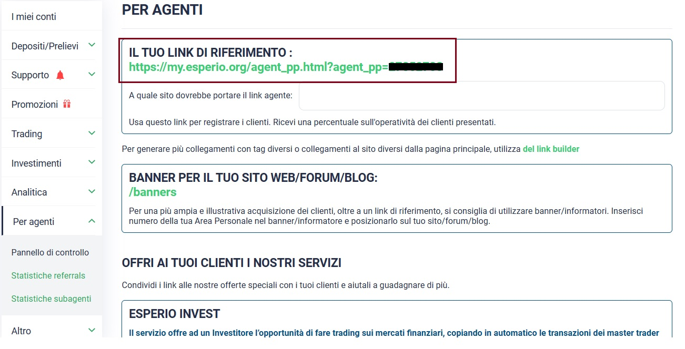

# 🔗 Come Ottenere il Referral Link

***

Per acquisire il proprio link di affiliazione, **non è necessario inviare alcuna richiesta specifica**. Una volta che avete creato con successo il conto di tipo AGENT, verrà automaticamente generata una sezione dedicata per l'affiliazione al broker.

### **Accesso all'Account**

Avvia il tuo browser web e accedi al sito web di Esperio. In alto a destra, troverai l'opzione "Accesso" o "Login". Clicca su di essa e inserisci le tue credenziali di accesso per accedere al tuo account.

All'interno della pagina principale del broker, **nella barra di navigazione situata sulla sinistra**, verrà resa disponibile l'opzione **"Per Agenti"** una volta che avrete creato con successo il conto di tipo agente. Cliccando su questa opzione, verrà visualizzato un **menu a tendina**.

All'interno del menu a tendina, nella **prima sezione denominata "Pannello di Controllo"**, troverete il vostro **link di riferimento**. Questo link rappresenta il vostro referral link per il programma di affiliazione. Qui di seguito è riportato un esempio per illustrarvi dove trovare tale link nella piattaforma.

<figure><figcaption></figcaption></figure>


Condividendo **questo link** con la tua community, avrai l'opportunità di accedere a un **piano marketing unico**, che opera su **più linee di profondità**.

[**Clicca qui per maggiori informazioni sul Piano di Marketing**.](cose-un-sistema-di-affiliazione.md)


Sempre all'interno della sezione **"Per Agenti"**, troverete ulteriori sotto-sezioni come **"Statistiche Referrals"** e **"Statistiche Subagenti"**. Attraverso queste sezioni, è possibile monitorare l'andamento della propria rete, tra cui i nominativi dei referral, i depositi dei clienti, e altri dati pertinenti. Questa sezione risulta estremamente utile per **verificare che le persone invitate si registrino correttamente all'interno della tua struttura**.


**Importante da Tenere a Mente**:

* **Condivisione Responsabile**: Condividi il referral link solo con persone che ritieni potrebbero essere interessate a Esperio e al suo programma di affiliazione.
* **Rispetto delle Linee Guida**: Assicurati di rispettare le linee guida e le regole del programma di affiliazione di Esperio quando condividi il link.
* **Monitoraggio delle Conversioni**: Alcune piattaforme di affiliazione potrebbero offrire strumenti per monitorare le conversioni generate dal tuo referral link.

Seguendo questi passaggi, sarai in grado di reperire il tuo referral link su Esperio e condividerlo con potenziali interessati in modo efficace e responsabile.

