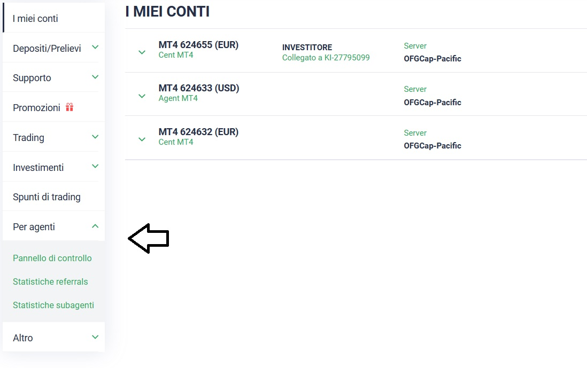

# 👨⚖ Sezione per Agenti

***

Nella home page, cliccando sezione "per agenti" vi si aprirà un menu a tendina.\


Vi saranno 3 sezioni tra cui poter scegliere. Ogni sezione ha una sua utilità.


<figure><figcaption></figcaption></figure>

* **Sezione Pannello di controllo:** In questa sezione posso reperire il mio link referral unico per l'iscrizione al BROKER, condividi questo link per far crescere la tua rete.
* **Sezione Statistiche referrals**: Quà potrò vedere **SOLO** i miei clienti **diretti** con le caratteristiche dei loro conti.&#x20;
* **Statistiche subagenti**: In questa sezione avrò accesso a tutta la mia rete, (_diretti & indiretti_), ma non vedrò i clienti che non hanno il conto **AGENT**.\
  \


I miei Diretti o Indiretti saranno visibili una volta aperto il conto AGENT.\
\
[**Clicca qua**](../il-broker/come-iniziare/come-iscriversi.md#creazione-conto-agent) per maggiori info. riguardo al conto AGENT

